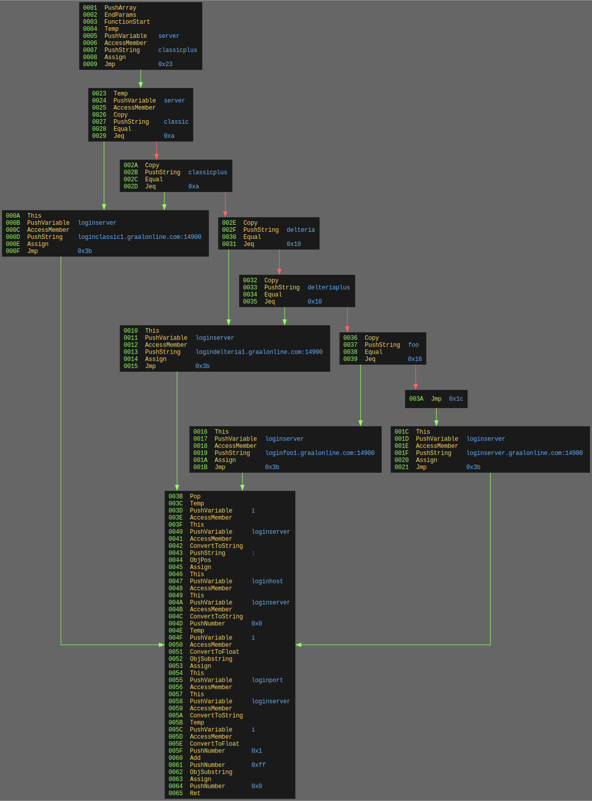

# gbf-rs
[](https://codecov.io/gh/Preagonal/gbf-rs)
[](https://github.com/cernec1999/gbf-rs/actions/workflows/rust-ci.yml)

`gbf_core` is a Rust library designed to analyze, disassemble, process, and decompile Graal Script 2 (GS2) bytecode. It provides tools for GS2 bytecode analysis, control flow graph (CFG) generation, and abstract syntax tree (AST) construction, with a focus on modern Rust best practices.

## Features

- **GS2 Bytecode Analysis**:
  - Decode and analyze GS2 bytecode for program analysis.
- **Disassembly and Decompilation**:
  - Disassemble bytecode into human-readable instructions.
- **Control Flow Graph Visualization**:
  - Generate and render CFGs using Graphviz-compatible DOT files.
- **Abstract Syntax Tree (AST) Construction**:
  - Build ASTs from bytecode to enable higher-level program understanding.
- **Customizable Graph Rendering**:
  - Flexible, trait-based rendering for both pre-processed and post-processed CFGs.
- **Modular Design**:
  - Highly extensible and idiomatic Rust library design.

## Getting Started

### Installation

Add `gbf_core` as a dependency in your `Cargo.toml`:

```toml
[dependencies]
gbf_core = "0.2.0"
```

### Minimum Supported Rust Version
This project supports Rust 1.81.0 and later.

### Usage

### Decompile GS2 Bytecode

Decompiling GS2 Bytecode is easy and extremely customizable in `gbf_core`. We can do so by loading a GS2 module and invoking the `FunctionDecompiler`, like so:

```rs
use std::{fs::File, io::Read, path::Path};

use gbf_core::decompiler::{
    ast::visitors::emit_context::{EmitContextBuilder, EmitVerbosity, IndentStyle},
    function_decompiler::FunctionDecompiler,
};

fn load_bytecode(name: &str) -> Result<impl Read, std::io::Error> {
    let path = Path::new("tests").join("gs2bc").join(name);
    let file = File::open(path)?;
    Ok(file)
}

fn main() {
    // Load `simple.gs2bc` bytecode file
    let reader = load_bytecode("simple.gs2bc").unwrap();
    let module = gbf_core::module::ModuleBuilder::new()
        .name("simple.gs2".to_string())
        .reader(Box::new(reader))
        .build()
        .unwrap();

    // Get the first function in the module
    let function = module.get(0).unwrap();

    // Configure the emitter to use specific formatting
    let context = EmitContextBuilder::default()
        .verbosity(EmitVerbosity::Pretty)
        .format_number_hex(true)
        .indent_style(IndentStyle::Allman)
        .build();
    
    // Invoke the `FunctionDecompiler`
    let mut decompiler = FunctionDecompiler::new(function.clone()).unwrap();
    let decompiled = decompiler.decompile(context).unwrap();
    println!("{}", decompiled);
}
```

This is the resulting GS2 decompilation for `simple.gs2bc`:

```js
player.chat = "Hello, World!";
echo("This is a test");
temp.x = 0x0;
temp.x += 0x2;
echo(temp.x);
```

#### Generate Control Flow Graph (CFG)

This library can generate directed control flow graphs using Graphviz. We can load arbitrary GS2 bytecode using the following Rust code:

```rs
use std::{fs::File, io::Read, path::Path};

use gbf_core::{
    cfg_dot::{CfgDotConfig, DotRenderableGraph},
};

fn load_bytecode(name: &str) -> Result<impl Read, std::io::Error> {
    let path = Path::new("tests").join("gs2bc").join(name);
    let file = File::open(path)?;
    Ok(file)
}

fn main() {
    // Load `switch.gs2bc` bytecode file
    let reader = load_bytecode("switch.gs2bc").unwrap();
    let module = gbf_core::module::ModuleBuilder::new()
        .name("switch.gs2".to_string())
        .reader(Box::new(reader))
        .build()
        .unwrap();

    // Get the first function in the module. The "entry"
    // function is 0, so this really is the "first"
    // function.
    let function = module.get(1).unwrap();

    println!("{}", function.render_dot(CfgDotConfig::default()));
}
```

<details> 
  <summary>As an example, consider this simple GS2 switch statement.</summary>

  ```js
  function switchWithMultipleCasesPerNode() {
      temp.server = "classicplus";
      switch (temp.server) {
          case "classic":
          case "classicplus":
              this.loginserver = "loginclassic1.graalonline.com:14900";
              break;
          case "delteria":
          case "delteriaplus":
              this.loginserver = "logindelteria1.graalonline.com:14900";
              break;
          case "foo":
              this.loginserver = "loginfoo1.graalonline.com:14900";
              break;
          default:
              this.loginserver = "loginserver.graalonline.com:14900";
              break;
      }
      temp.i = this.loginserver.pos(":");
      this.loginhost = this.loginserver.substring(0, temp.i);
      this.loginport = this.loginserver.substring(temp.i + 1, 255);
  }
  ```

  The resulting Graphviz code that `gbf_core` generates will look like this when exported:
  
</details>

To export the resulting Graphviz code, you can use the popular `dot` utility like so:

```sh
$ dot -Tpng cfg.dot -o cfg.png
```

#### Build Abstract Syntax Trees (ASTs)

The library can also be used to manually build ASTs. Not only can you access the AST from the decompiled output, there are helper functions you can use to define your own AST for testing purposes:

```rs
use gbf_core::decompiler::ast::{emit, member_access, new_id, new_str, statement, AstNodeError};

fn build_player_chat() -> Result<String, AstNodeError> {
    // player.chat = "Hello, world!";
    let stmt = statement(
        member_access(new_id("player"), new_id("chat"))?,
        new_str("Hello, world!"),
    );
    Ok(emit(stmt))
}

fn main() -> Result<(), AstNodeError> {
    let result = build_player_chat()?;
    println!("{}", result);
    Ok(())
}
```

## Development

### Prerequisites

- Rust 1.81.0 or later
- Graphviz (optional, for rendering CFGs)

### Build and Test

To build the library:

```bash
$ cargo build
```

To run tests:

```bash
$ cargo test
```

To check formatting:

```bash
$ cargo fmt --all -- --check
```

To lint the code:

```bash
$ cargo clippy --workspace --all-targets -- -D warnings
```

### Documentation

Generate and view the documentation locally

```bash
$ cargo doc --no-deps --workspace
```

## Contributing

Contributions are welcome! If you’d like to contribute:

1. Fork the repository.
2. Create a new branch (`git checkout -b feature-branch`).
3. Commit your changes (`git commit -m "Add a new feature"`).
4. Push the branch (`git push origin feature-branch`).
5. Open a pull request.

Please ensure your code passes all tests and adheres to the project’s style guidelines.

## License & Legal Disclaimer

This project is licensed under the Mozilla Public License 2.0 and is not affiliated with GraalOnline or its owners. GraalOnline and Graal are registered trademarks of Stephane Portha, and all trademarks are the property of their respective owners.

This project includes code from the Rust project, which is licensed under either
the MIT License or Apache License 2.0. You may choose either license when
copying the code included from the Rust project.

The original Rust code is available at: [ptr.rs](https://github.com/rust-lang/rust/blob/master/compiler/rustc_ast/src/ptr.rs)

## Acknowledgments

- **Rust**, for being awesome.
- **Graphviz** is used to make human-readable directed graphs for debugging purposes.
- **petgraph** is used to implement the directed graph functionality.
- **NextJS** is used to render the front-end test environment.
- **Netlify** is used to host the front-end test environment.

## Contact

If you have any questions or feedback, feel free to reach out via the repository's [issues](https://github.com/cernec1999/gbf-rs/issues) section.

---

Happy hacking!
